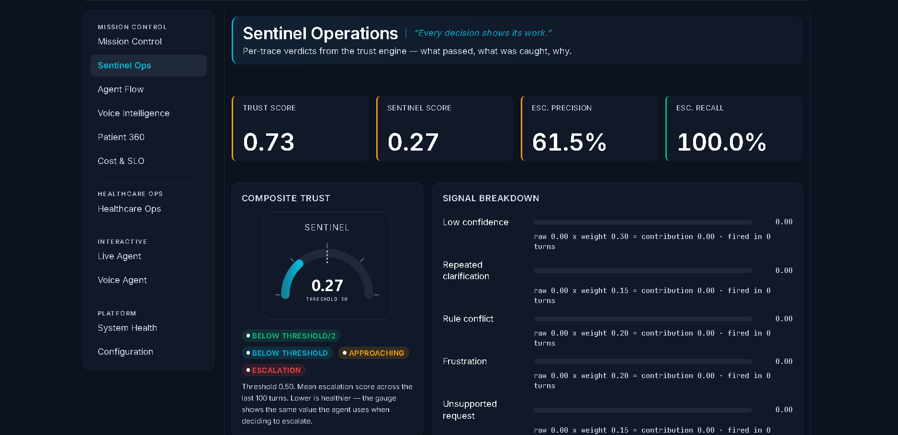
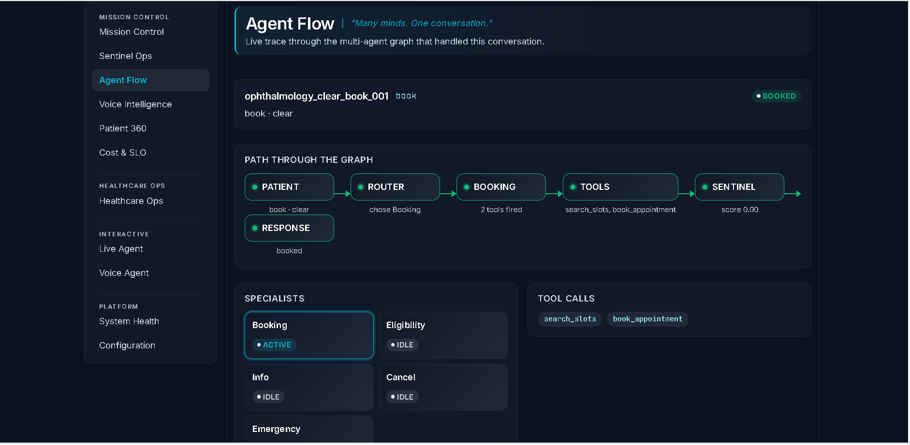
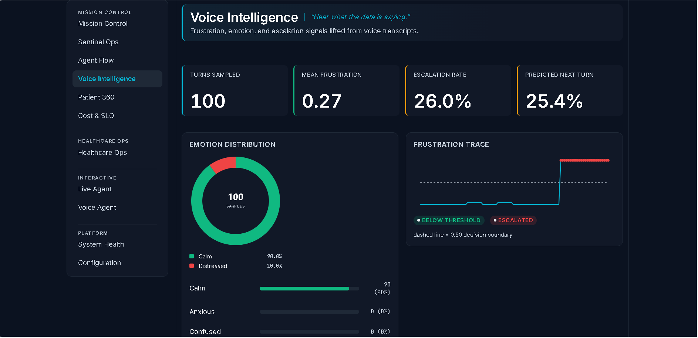
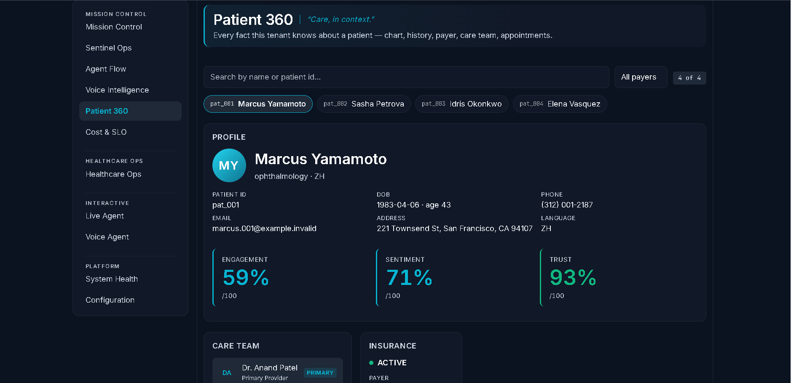
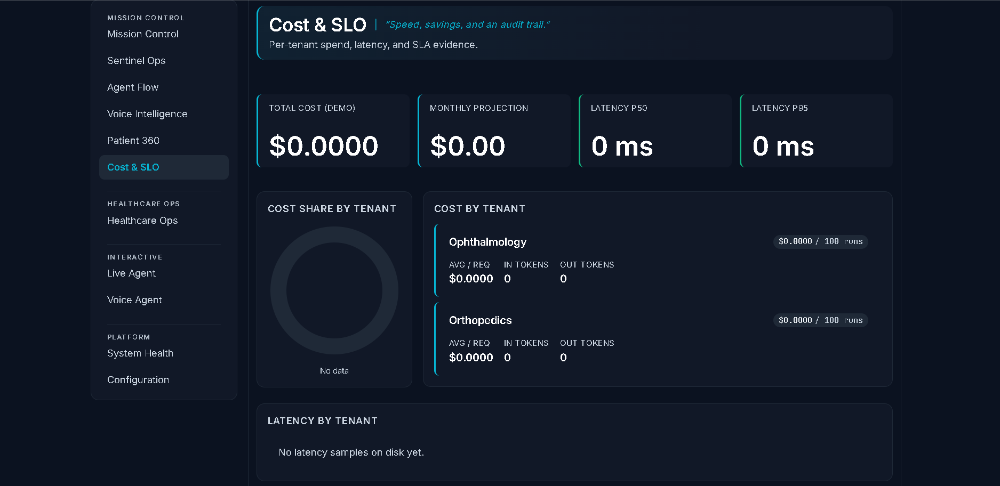
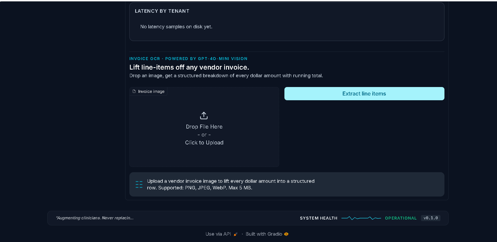
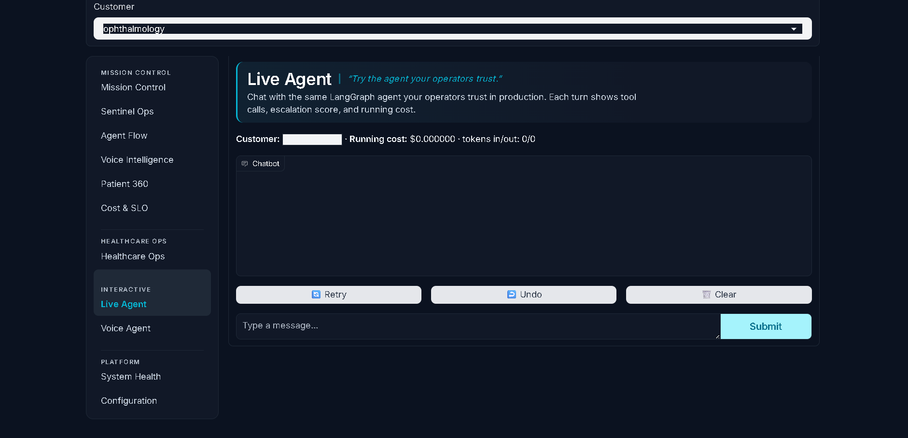
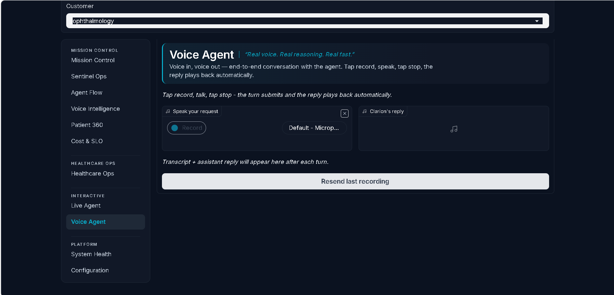

<div align="center">

# Clarion

**A multi-tenant healthcare voice agent that doesn't trust itself.**

[](#testing)
[](pyproject.toml)
[](#testing)
[](LICENSE)
[](huggingface/README.md)

[Live demo](huggingface/README.md) &middot;
[Screenshots](#screenshots) &middot;
[How it works](#how-it-works) &middot;
[The story behind the code](#a-story-from-week-three) &middot;
[Run it locally](#run-it-locally)

</div>

---

## A story from week three

A few weeks into this project, my agent quietly booked an appointment
under the patient name `"Ranjit Kumar Madhirala"`. That's me. The
agent had lifted my name out of the conversation and shoved it into
the `patient_id` field on the booking tool. Pydantic was happy. The
database accepted it. The Patient 360 view rendered it straight back
at me on screen.

Everything worked, except the data was nonsense.

That's the kind of failure mode you don't catch with unit tests. It's
also the kind you find out about exactly once, on real production
data, when a real patient calls. The fix was four lines &mdash; a
regex pattern on the tool's input schema &mdash; but the real lesson
sat underneath: an AI agent will absolutely do something stupid the
moment you stop watching, and the model isn't the place you stop it.
The tools, the schemas, and the trust engine are.

That story turned into the spine of the whole project. The rest of
this README is what I built around it.

---

## What this is

Clarion is the AI scheduling layer for a specialty medical practice's
front desk. It handles the routine work that drowns the phone queue
&mdash; bookings, eligibility checks, rescheduling, payer questions
&mdash; and it recognises the calls that should never reach an
automated system: a sudden vision loss, a chest pain, a patient
asking for clinical advice.

It does that through a typed tool registry the agent can't easily
talk around. Around the agent sits a separate trust engine that
grades every reply after the fact, from outside the model's own
perspective. If the agent thinks it answered correctly and the judge
disagrees, the judge wins. If five weighted escalation signals add up
past a threshold, the call goes to a human regardless of what the
agent wanted to do.

Healthcare is the demonstration vertical, not the product. The whole
architecture is built so adding a new vertical &mdash; dermatology,
dental, ortho urgent care &mdash; is a one-day YAML + seed-data job
that never touches the agent loop. The repo ships with two fully
configured tenants and proves the boundary works: the orthopedics
agent has *never* seen a `cancel_appointment` tool, because that line
isn't in its YAML.

I built this because I wanted to know what it would actually take to
ship a customer-facing AI agent I'd trust at the front desk of a real
clinic. Not the demo bot. The thing that takes the call when nobody's
looking.

---

## Screenshots

| | |
|:--:|:--:|
|  <br/> **Sentinel Operations** &mdash; composite trust gauge + five-signal breakdown across the last 100 turns. The trust engine grades every reply independently of the agent that produced it. |  <br/> **Agent Flow** &mdash; live trace through the LangGraph for one conversation. Router &rarr; booking specialist &rarr; tools &rarr; Sentinel, with the path the agent actually took highlighted. |
|  <br/> **Voice Intelligence** &mdash; emotion donut + frustration trace + per-turn escalation prediction lifted from voice transcripts. The chart spikes the moment the caller's tone shifts. |  <br/> **Patient 360** &mdash; roster chips, profile, care team, insurance, and a downloadable appointment confirmation generated from the actual conversation. |
|  <br/> **Cost & SLO** &mdash; per-tenant spend, latency budgets, cost share by tenant. The CFO's view of an AI agent. |  <br/> **Invoice OCR** &mdash; drop a vendor invoice image, gpt-4o-mini Vision lifts every dollar amount into a structured row with running total. One Python module, one route, one Gradio component. |
|  <br/> **Live Agent** &mdash; chat with the production LangGraph agent. Every turn surfaces the tool calls, escalation score, and running cost so you can see exactly how it's thinking. |  <br/> **Voice Agent** &mdash; end-to-end voice round-trip. Whisper transcribes, the same agent core decides, OpenAI TTS reads the reply back. |

---

## How it works

```
                 ┌─────────────────────────────────────────┐
                 │     11-tab Gradio dashboard             │
                 │  reads only clarion.schemas             │
                 └─────────────┬───────────────────────────┘
                               │
            ┌──────────────────┴──────────────────┐
            │                                     │
            ▼                                     ▼
 ┌────────────────────┐              ┌────────────────────────┐
 │  FastAPI service   │              │  Evaluation harness    │
 │  /chat /voice/turn │              │  100 scenarios/tenant  │
 │  /cost/extract-…   │              │  locked schema v1.0.0  │
 └─────────┬──────────┘              └───────────┬────────────┘
           │                                     │
           ▼                                     │
 ┌──────────────────────┐                        │
 │  Sentinel            │                        │
 │  guardrails + judge  │◀───────────────────────┘
 │  + escalation scorer │
 └─────────┬────────────┘
           │
           ▼
 ┌──────────────────────┐
 │  LangGraph agent     │
 │  router → specialist │
 │  → supervisor        │
 └─────────┬────────────┘
           │
           ▼
 ┌──────────────────────┐
 │  Foundation          │
 │  YAML config · RAG · │
 │  SQLite · tools      │
 └──────────────────────┘
```

Three layers worth talking about.

### The dashboard

A Gradio Blocks app with eleven tabs. Each one reads typed dataclasses
from `clarion.schemas` and renders them as pure HTML. The UI never
imports `clarion.evaluation` &mdash; that boundary is structurally
enforced by what resolves at import time. A new metric is always a
backend change. If a view tries to recompute one, the module doesn't
load. The discipline matters because the moment two pieces of code
disagree about what "containment rate" means, you've shipped a bug
to a CFO.

### The API

FastAPI with three routes that matter: `/chat` for a text turn,
`/voice/turn` for the full speech round-trip, and
`/cost/extract-invoice` for the vision OCR. A session manager keys
agents on `(customer_id, conversation_id)` so a session can mix
voice and text and the transcript stays coherent. Every request
carries a correlation ID through the middleware stack and out into
structured JSON logs. When something goes wrong, the operator can
follow one ID across three logs and find the failing turn.

### The agent

A LangGraph state graph. A small classifier (`IntentRouter`) maps
each turn to one of five specialists &mdash; Booking, Eligibility,
Info, Cancel, Emergency. Here's the load-bearing part: each
specialist sees **only the subset of tools its YAML allows**. The
Info specialist literally cannot call `book_appointment`, because
that tool was never advertised on its tool list. A prompt-injection
attempt aimed at the Info path has nowhere to reach.

After each specialist runs, a supervisor node decides one of three
things: finish, route to a different specialist (bounded by a visit
counter so it can't loop), or escalate to a human. The decision is
rule-based, not LLM-backed &mdash; the choice space is three options,
the cost matters, and I want the trace to be auditable.

### Sentinel — the trust engine

Wrapped around all of that. Three components, each with a deliberate
failure mode:

| Component | Output | When it fails, it fails by... |
|---|---|---|
| **Guardrails** (emergency / clinical / PHI) | Short-circuits the reply &mdash; the LLM is never called for an emergency turn | Crying wolf. Pattern-based. Prefers false alarms over silence. |
| **LLM-as-Judge** (booking + hallucination + policy) | A structured verdict per turn, parsed defensively | Defaulting to low confidence on malformed JSON. The judge admits when it can't decide. |
| **Escalation scorer** | A 0&ndash;1 score fusing five weighted signals | Calling for a human. The threshold is in the tenant YAML, so anxious tenants can dial it down. |

The judge runs *after* the agent has replied. So even if the agent
thinks it got the answer right, the system grades the answer from
outside. That separation has caught two real bugs in evaluation
&mdash; a hallucinated specialty on a tenant that doesn't offer it,
and a booking where the agent confirmed a time that conflicted with
the slot it had actually reserved. Plausible failures. The judge
caught them because it had no skin in the game.

---

## Things I cared about while building it

A few decisions in the code that are easy to miss skimming the file
tree.

### The agent shouldn't be able to do anything it wasn't supposed to

The Pydantic `BookAppointmentInput` rejects free-form text in ID
fields. That sounds like paranoia until the day the LLM hallucinates
a patient's full name into `patient_id` and the row lands in your
SQLite store, where the Patient 360 view renders it as the patient's
name and the appointment confirmation prints it on the printable
PDF. That was the story I opened with. The fix:

```python
patient_id    : Field(pattern=r"^[A-Za-z][A-Za-z0-9_\-]{0,63}$")
patient_name  : Field(pattern=r"^[A-Za-zÀ-ÿ'\-]{2,}(\s+[A-Za-zÀ-ÿ'\-]{1,}){1,4}$")
patient_phone : Field(pattern=r"^[\d\s\-\(\)\+\.]{7,25}$")
patient_email : Field(pattern=r"^[^\s@]+@[^\s@]+\.[^\s@]{2,}$")
```

Six tests lock in the rejection of the original bad input plus the
acceptance of international names, E.164 phone formats, and the
normal email shape. The relevant commit is
[`a36a72f`](https://github.com/Ranjith200228/clarion/commit/a36a72f).

### The same validation runs three layers deep

The booking specialist's system prompt explicitly asks the agent to
read the caller's name, phone, and email back to them before calling
the tool. The tool schema validates the same three fields with regex
patterns. The store persists them into the appointment's `notes`
column as JSON. The Patient 360 confirmation card prefers the
caller-confirmed values over the synthesised cosmetics the SQLite
roster generates by default. The prompt is a soft hint. The schema
is a hard wall. The persistence is the contract that lets the rest
of the system trust the caller's identity downstream. A real contract
wants all three.

### Tools are advertised per specialist

The Booking specialist sees five tools. The Info specialist sees one.
The Emergency specialist sees zero &mdash; it's a deterministic
911-redirect node, no LLM call, no risk of clever talking. The
orthopedics tenant doesn't enable `cancel_appointment` at all, so
that agent has *never seen* a cancel tool on any call. Multi-tenancy
is an allowlist, not a code branch. Every time I caught myself
reaching for `if customer_id == "..."`, the right answer was always
a new YAML field instead.

### The report contract is locked

Adding a metric is additive only. New optional field on
`EvaluationReport.metrics`, schema version stays `1.0.0`, the locked
schema regression test passes. The dashboard reads from this
contract; it never recomputes anything. That has saved hours of
debugging when a metric definition shifts and three different pieces
of code suddenly disagree about which definition is right. There is
exactly one source of truth, and it's the JSON file.

### Vision OCR was a one-day add-on, not a rewrite

The Cost & SLO tab has an invoice uploader that posts to
`/cost/extract-invoice`, which calls gpt-4o-mini in JSON mode with a
strict extraction prompt. The response is parsed defensively (strip
code fences, coerce number strings, drop malformed line items) into
the same kind of typed dataclass everything else in the app uses.
Total surface: one Python module, one FastAPI route, one Gradio
component, one CSS block. The module boundary that kept Sentinel
decoupled from the agent is the same one that made this whole new
capability so cheap to ship.

---

## Run it locally

```bash
git clone https://github.com/Ranjith200228/clarion.git
cd clarion
poetry install
export OPENAI_API_KEY=sk-...

# Populate evaluation artifacts (synthetic; run once)
poetry run python -m clarion.eval --customer all

# Terminal 1 — the FastAPI backend
poetry run python -m uvicorn api.app:app --host 0.0.0.0 --port 8000

# Terminal 2 — the dashboard
poetry run python -m gradio_app

# Open http://localhost:7860
```

The dashboard works without the API for everything that reads
artifacts off disk &mdash; only Live Agent, Voice Agent, and Invoice
OCR need the backend.

For containers:

```bash
docker compose up    # API + dashboard side-by-side
```

The multi-stage Dockerfile pre-bakes the FAISS indices in the builder
stage. A fresh container is serving requests in under two seconds.

---

## What's underneath

| Layer | Choice and why |
|---|---|
| **Language** | Python 3.11+, mypy strict on the agent core. The whole point is type contracts. |
| **Validation** | Pydantic v2 at every boundary; every tool schema is `extra="forbid"` so the model can't smuggle unknown fields. |
| **LLM** | OpenAI &mdash; `gpt-4o-mini` for chat and vision, `whisper-1` for STT, `tts-1` for TTS, `text-embedding-3-small` for RAG. Picked for the price-to-capability ratio, not the brand. |
| **Orchestration** | LangGraph (StateGraph) for the multi-agent backend. A single-`Agent` ReAct loop is also available and toggled per tenant in YAML. |
| **Trust engine** | Hand-rolled. Guardrails are regex + keyword. The judge is LLM-backed with a strict JSON contract. The escalation scorer fuses five signals with tunable weights. No off-the-shelf moderation library &mdash; I wanted the failure modes explicit. |
| **HTTP** | FastAPI. Custom middleware for correlation IDs and per-(tenant, IP) token-bucket rate limits. |
| **UI** | Gradio 4.44 Blocks + roughly 1,300 lines of design-token CSS. Eleven tabs, all driven from typed wire models. |
| **Resilience** | Retry with full-jitter backoff, circuit breaker around the LLM client (5 failures &rarr; 30s open). A flapping upstream doesn't bring everything down with it. |
| **Storage** | Per-tenant SQLite (`structured.sqlite`) for slots, appointments, eligibility, PMS tasks. FAISS for vector RAG. |
| **ML side** | XGBoost no-show classifier with held-out ROC-AUC and top-decile lift folded into the locked report. Synthetic training data only &mdash; never PHI. |
| **Tests** | 580 pytest, CI matrix on 3.11 and 3.12, ruff + mypy strict at the gate. |
| **Deploy** | Multi-stage Docker. Primary target is a Hugging Face Space. Manifests also for Cloud Run, Render, Fly.io. |

---

## Repository layout

```
clarion/
  agents/             Single-Agent ReAct loop + OpenAI client wrapper
  multiagent/         LangGraph backend: router, specialists, supervisor
  sentinel/           Trust engine — guardrails, judge, escalation, PHI
  schemas/            Pydantic wire models. The contract between layers.
  modules/            Opt-in post-launch capabilities
    invoice_ocr.py        gpt-4o-mini Vision invoice extraction
    no_show_prediction/   XGBoost classifier, persisted to joblib
    pms_writeback/        Conversation → summary.json + task.json
    voice/                Whisper + OpenAI TTS round trip
  pipelines/          Structured store (SQLite) + RAG retriever
  resilience/         Retry, circuit breaker, rate limit
  evaluation/         100-scenario harness, locked report writer
  observability/      Structured JSON logs, correlation IDs, spans
  config/             Settings + per-tenant YAML loader

api/
  app.py              FastAPI factory
  routes/             /chat /voice/turn /cost/extract-invoice /health
  middleware/         Correlation IDs + rate limiter
  sessions.py         Per-(tenant, conversation) session manager

gradio_app/
  app.py              11-tab Blocks shell + customer switcher
  views/              One file per tab, pure HTML render functions
  components.py       Shared visual primitives (KPI tile, donut, …)
  data_sources.py     Typed roll-ups consumed by the views
  tab_*.py            Stateful tabs (live agent, voice agent, cost OCR)
  theme.py / style.css   Design tokens and primitive CSS

configs/              Per-tenant YAML
data/                 Per-tenant artifacts (gitignored — re-generated by harness)
tests/                580 pytest tests (unit + integration + e2e)
docs/                 Discovery doc, dev/deploy guides, security review
loadtest/             Locust profile + in-process p95 SLA test
huggingface/          HF Spaces deployment manifest
```

---

## Testing

```bash
poetry run pytest                              # the full 580
poetry run ruff check clarion gradio_app api tests
poetry run mypy --strict clarion api
poetry run pytest -m loadtest                  # opt-in p95 SLA budget
```

What's in those 580 tests:

- The end-to-end ophthalmology and orthopedics booking flows,
  driven by a scripted `FakeLLM` so CI never needs a real key.
- The boundary regex guards on `BookAppointmentInput` &mdash; six
  cases covering single-word names, "ask me later" phones, "n/a"
  emails, and the international + E.164 formats they should still
  accept.
- A schema-regression test on the locked `EvaluationReport` v1.0.0
  contract. Additive changes pass. Anything that would rename or
  retype an existing field fails the gate.
- An opt-in `loadtest` marker that runs an in-process p95 latency
  budget against a `FakeLLM` so the numbers reflect framework +
  middleware + agent overhead. For real-OpenAI numbers, the Locust
  profile in `loadtest/locustfile.py` runs against a deployed
  instance.

---

## What I learned

Four things that surprised me while building this.

**The hardest part was never the model.** It was deciding what the
agent's tools *aren't* allowed to do. Pydantic regex guards on ID
fields prevented exactly one production bug (the patient-name-as-id
incident) and probably several I never noticed. The cost was a few
lines of code. The value was the dashboard not silently rendering
garbage on rounds where I wasn't looking.

**LangGraph's biggest gift is tool scoping, not orchestration.** The
classifier hop adds latency I'd rather not have. What I *do* want is
that the Info specialist literally can't book an appointment, because
the tool has never been advertised to it. That's a property of the
graph structure, not the prompt. A jailbreak attempt has no target
to aim at when the target isn't there.

**The independent judge has earned its keep.** It's caught two bugs
during evaluation that would have looked plausible to a human
reviewer: a hallucinated specialty on a tenant that doesn't offer
it, and a booking that confirmed a time that didn't match the slot
the agent had actually reserved. The judge runs from outside the
agent, so it doesn't share the agent's blind spots.

**Pre-aggregated UI feeds in the locked report saved hours.** Every
time I added a new view my first instinct was "let me just call the
metric function". Every time I resisted, the view ended up smaller
and the schema ended up clearer. The instinct is wrong &mdash; the
discipline is right. Doing the math once, in one place, before the
data ever reaches the UI, is the difference between a dashboard
that's trustworthy and a dashboard that's almost trustworthy.

---

## Status

Shipped, in this order:

- **v1.0.0** (tagged 2026-06-12) &mdash; single-Agent ReAct backend,
  Sentinel trust engine, locked evaluation schema, FastAPI service,
  production hardening, 100-scenario reports for both tenants.
- **LangGraph multi-agent backend** &mdash; opt-in per tenant via
  `use_multiagent: true`.
- **PMS writeback** &mdash; conversation to `summary.json` +
  `task.json` with PHI redaction at the writer.
- **No-show prediction** &mdash; XGBoost classifier with held-out
  ROC-AUC and top-decile lift in the locked report.
- **Voice layer** &mdash; Whisper STT + OpenAI TTS round trip.
- **Gradio dashboard rewrite** to the eleven-tab shell.
- **Invoice OCR** &mdash; gpt-4o-mini Vision in the Cost & SLO tab.
- **Engagement layer** &mdash; time-of-day greeting, per-tenant
  accent identity, KPI value entrance animation.
- **Boundary regex guards** on every tool ID field after the
  patient-id hallucination incident.
- **Caller-confirmed contact details** flow from conversation through
  to the printable confirmation card.

What I'm working on next:

- Live-mode evaluation with real OpenAI numbers in the report.
- A fine-tuned classifier behind `BookingSpecialist` to cut prompt
  size and latency.
- Moving the Hugging Face Space to a custom domain.

---

## Reading deeper

| If you want to read... | Open... |
|---|---|
| Why this exists at all | [docs/discovery.md](docs/discovery.md) |
| How to set up locally and onboard a new tenant | [docs/developer_guide.md](docs/developer_guide.md) |
| How to deploy to one of the four supported targets | [docs/deployment_guide.md](docs/deployment_guide.md) |
| The STRIDE-shaped security audit (the honest part is the gaps list) | [docs/security_review.md](docs/security_review.md) |
| The locked-schema evaluation reports | [reports/v1.0.0/](reports/v1.0.0/) |
| What shipped, in order, with code pointers | [CHANGELOG.md](CHANGELOG.md) |

---

[MIT](LICENSE) &copy; 2026 Ranjith Maddirala.

If any layer of this is useful to you, or you want to dig into a
specific decision, I'm at `ranjithmaddirala24@gmail.com`. I'd love to
hear what you'd have done differently.
