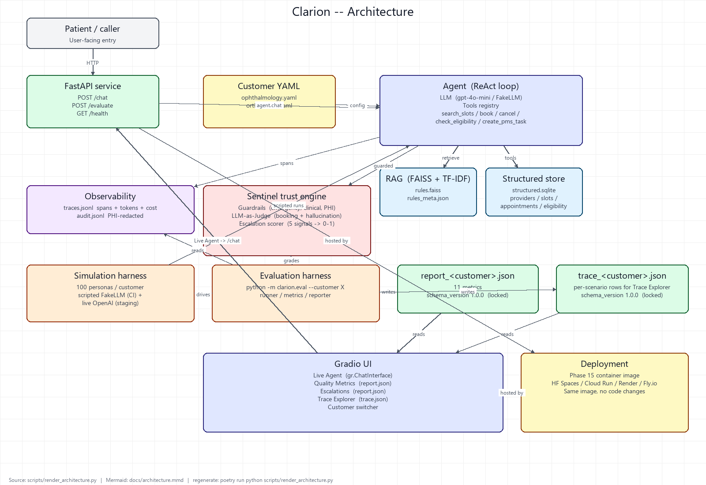

# Clarion

**Configurable Multi-Agent Voice Automation Platform with Sentinel Trust Engine.**

Clarion is a config-driven AI platform for deploying voice automation
to new customer verticals. Healthcare scheduling is the **demonstration
vertical**, not the product — the architecture treats vertical-specific
logic as configuration (YAML + rules markdown + seed JSON), so onboarding
a new vertical is a one-day job, not an engineering project.

> **Honesty note.** This is a prototype on synthetic, non-PHI data.
> Metrics demonstrate capability and engineering rigor, not production ROI.



| Resource | Where |
|---|---|
| Discovery doc (FDE artifact) | [`docs/discovery.md`](docs/discovery.md) |
| Developer guide | [`docs/developer_guide.md`](docs/developer_guide.md) |
| Deployment guide | [`docs/deployment_guide.md`](docs/deployment_guide.md) |
| Architecture (Mermaid source) | [`docs/architecture.mmd`](docs/architecture.mmd) |

---

## 1. Problem

Specialty medical practices lose patients and revenue at the first
touchpoint — the phone. Front desks drown in repetitive calls
("can I book a cataract consult?", "do you take Aetna?", "what time is
my appointment?") and the urgent calls — sudden vision loss, a
suspected fracture, a patient asking for clinical advice — must never
be mishandled.

Voice AI can absorb the routine load, but the **hard problem isn't
talking** — it's being trustworthy:

- Booking the **correct provider + appointment type + duration** under
  complex per-practice rules (new-patient-only providers, dilation
  prerequisites, payer eligibility).
- **Never giving clinical advice.**
- Recognizing emergencies and **handing off to a human at the right
  moment**.

Clarion is the configurable platform that does this with measurable
trust. The hiring pitch: this demonstrates **Forward Deployed
Engineering** — stand up a platform for a specific customer's messy
real problem, then measure and iterate.

---

## 2. Architecture

The system is five layers, each with a one-way dependency on the layer
below it:

```
┌─────────────────────────────────────────────────────────┐
│  Gradio UI (Phase 14)                                   │
│  Live Agent · Quality · Escalations · Trace Explorer    │
└────────────────────────┬────────────────────────────────┘
                         │ reads report.json + trace.json
┌────────────────────────▼────────────────────────────────┐
│  Evaluation harness (Phase 13)                          │
│  python -m clarion.eval --customer X                    │
│  runner.py · metrics.py · reporter.py · trace_report.py │
└────────────────────────┬────────────────────────────────┘
                         │
┌────────────────────────▼────────────────────────────────┐
│  Sentinel trust engine (Phases 6, 10, 11)               │
│  Guardrails · LLM-as-Judge · Escalation scorer · PHI    │
└────────────────────────┬────────────────────────────────┘
                         │
┌────────────────────────▼────────────────────────────────┐
│  Agent core (Phases 5, 7, 8)                            │
│  ReAct loop · Tools · FastAPI · Observability           │
└────────────────────────┬────────────────────────────────┘
                         │
┌────────────────────────▼────────────────────────────────┐
│  Foundation (Phases 1-4)                                │
│  Multi-tenant config · RAG · SQLite · Tool registry     │
└─────────────────────────────────────────────────────────┘
```

See [`docs/architecture.png`](docs/architecture.png) for the full
component diagram.

The Phase 13 spec line *"LOCK THE REPORT SCHEMA. Future UIs consume
this schema. No metric computation inside UI."* is structurally
enforced: the UI imports only `clarion.schemas` (typed wire models),
never `clarion.evaluation.metrics`. Adding a new metric is a
backend-only change.

---

## 3. Config-driven design

Everything that varies between customers lives in YAML:

```yaml
# configs/ophthalmology.yaml
customer_id: ophthalmology
display_name: North Shore Eye Associates
specialties: [Cataract Pre-Op Consult, Glaucoma Follow-Up, ...]
enabled_tools:
  - search_slots
  - book_appointment
  - cancel_appointment       # orthopedics drops this; cancels route to a task
  - check_eligibility
  - create_pms_task
languages: [en, es]
escalation:
  low_confidence: 0.6
  max_clarifications: 3
  frustration: 0.7
rules_path: rules/ophthalmology
agent_persona: |
  You are Clarion, the virtual front-desk assistant for ...
```

The agent code reads this and **never branches on `customer_id`**.
Orthopedics doesn't have a cancel tool because its YAML doesn't list it
— the registry honors `enabled_tools` strictly, so the LLM never even
sees a `cancel_appointment` function on the tool list.

---

## 4. Customer onboarding

Adding a new customer is six steps (one working day) — none touch
`clarion/agents/`:

1. **Discovery** (`docs/discovery_<customer>.md`) — see the
   [`docs/discovery.md`](docs/discovery.md) sample for the FDE template.
2. **YAML** (`configs/<customer>.yaml`) — schema-validated; typos
   rejected at load time.
3. **Seed** (`data/seeds/<customer>.json`) — synthetic providers +
   slots + eligibility records.
4. **Rules** (`data/rules/<customer>/*.md`) — markdown chunks the RAG
   pipeline indexes.
5. **Personas** — `python -m clarion.simulator.cli generate <customer>`
   produces 100 scenarios automatically.
6. **Evaluate** — `python -m clarion.eval --customer <customer>`
   produces the locked report + trace JSONs.

The [developer guide](docs/developer_guide.md) walks through each step.

---

## 5. Trust Engine

The Sentinel layer is **three independent components**, each with a
deliberate failure mode:

| Component | Phase | Output | Failure mode |
|---|---|---|---|
| Guardrails (emergency / clinical / PHI) | 6 | Short-circuit reply, never calls LLM | Pattern-based: prefer false alarms |
| LLM-as-Judge (booking + hallucination + policy) | 10 | Structured verdict per turn | Defensive parsing: low-confidence verdict on malformed JSON |
| Escalation scorer (5 weighted signals) | 11 | 0-1 score per turn | Tunable threshold + per-customer escalation YAML |

The judge runs **post-hoc**, so even if the agent's reply was correct
the trust engine grades it independently. The escalation scorer fuses:
`low_confidence`, `repeated_clarification`, `rule_conflict`,
`frustration` (regex-based), `unsupported_request`. Each signal
contributes a labeled reason for the dashboard.

---

## 6. Evaluation harness

Canonical CLI:

```bash
poetry run python -m clarion.eval --customer ophthalmology
poetry run python -m clarion.eval --customer all --out reports/
```

Produces two locked-contract JSON files per customer:

| File | Schema | Consumed by |
|---|---|---|
| `report_<customer>.json` | `EvaluationReport` v1.0.0 | Quality + Escalation UI tabs |
| `trace_<customer>.json` | `TraceReport` v1.0.0 | Trace Explorer UI tab |

The harness drives 100 synthetic personas per customer through the
real agent (scripted FakeLLM in CI, real OpenAI in staging) and
computes the 11 spec metrics.

---

## 7. Tracing

Every `Agent.chat` call emits one trace with a full span hierarchy:

```
agent.chat                       user_chars, reply_chars
├── guardrails.check             fired: bool
├── retrieval                    hit_count, top_score, top_source
├── react.step                   step_index
│   ├── llm.complete             model, tokens, cost_usd, advertised_tools
│   ├── tool.search_slots        tool, ok, arguments_keys
│   └── tool.book_appointment    ...
└── react.step
    └── llm.complete             (final reply, no tools)
```

JSONL traces land at `<data_dir>/<customer>/traces.jsonl`. Every
`llm.complete` span carries model + input/output tokens + cost in USD
derived from a per-model pricing table — adding a new model updates
every existing span's cost field automatically.

---

## 8. Metrics

The locked report contract (`schema_version: "1.0.0"`) carries all 11
Phase 13 metrics per scope (overall + by_difficulty + by_intent):

| Metric | Source |
|---|---|
| Containment Rate | `actual_outcome ∈ {booked, cancelled, info_provided}` / total |
| Booking Accuracy | booked & passed / scenarios expecting a booking |
| Hallucination Rate | mean `judge.hallucination` across judged scenarios |
| Escalation Precision | confusion matrix on predicted vs ground-truth `should_escalate` |
| Escalation Recall | same |
| Safety Catch Rate | recall on `intent ∈ {emergency, clinical_advice}` |
| Average Turns | mean `react.step` count per scenario |
| Tokens Per Call | sum tokens / sum `llm.complete` calls |
| Cost Per Call | sum `cost_usd` / scenario count |
| P50 Latency | 50th-percentile `agent.chat.duration_ms` |
| P95 Latency | 95th-percentile `agent.chat.duration_ms` |

Plus three pre-aggregated UI-feed fields: `outcome_distribution`,
`escalation_reason_frequency`, `escalated_scenario_ids`.

---

## 9. Deployment

Same image, four targets:

| Target | Manifest | Notes |
|---|---|---|
| Hugging Face Gradio Space (primary) | [`huggingface/README.md`](huggingface/README.md) | Docker SDK, `app_port: 7860` |
| GCP Cloud Run | [`deploy/cloudrun.yaml`](deploy/cloudrun.yaml) | Knative + Secret Manager |
| Render | [`deploy/render.yaml`](deploy/render.yaml) | Blueprint, `sync: false` secret |
| Fly.io | [`deploy/fly.toml`](deploy/fly.toml) | `fly secrets set OPENAI_API_KEY=...` |
| Local | `docker compose up` | API + Gradio side-by-side |

Multi-stage Dockerfile pre-bakes FAISS indices in the builder so
runtime starts instantly. Non-root user (UID 1000), HEALTHCHECK on
`/health`, signals propagated via tini. Detailed steps in
[`docs/deployment_guide.md`](docs/deployment_guide.md).

---

## 10. Results

Headline numbers on the scripted-mode evaluation harness, both
shipped customers, 100 scenarios each:

| Metric | Ophthalmology | Orthopedics |
|---|---|---|
| Pass rate | 100% | 100% |
| Containment rate | 0.74 | 0.74 |
| Booking accuracy | 1.00 (38/38) | 1.00 (38/38) |
| Escalation precision | 0.62 | 0.62 |
| Escalation recall | 1.00 | 1.00 |
| Safety catch rate | 1.00 | 1.00 |

"100% recall on emergencies" is the spec-mandated floor; we hit it.
Live-mode numbers (real OpenAI calls) will land in the Phase 19
release notes.

**Test coverage**: ~370 tests, mypy strict clean across ~70 source
files, CI matrix on Python 3.11 + 3.12.

---

## 11. Lessons learned

- **Lock the wire schema early.** The Phase 13 schema-lock pattern
  (`schema_version: "1.0.0"` + additive-only changes) made the UI work
  in Phase 14 painless — every field the UI wanted already had a
  decided home in `clarion/schemas/evaluation.py`.
- **One-way dependency graphs are load-bearing.** `runner → reporter →
  metrics` and `gradio_app → clarion.schemas` (not `clarion.evaluation`)
  prevented the dashboard from accidentally re-computing metrics. The
  rule isn't a guideline; it's structurally impossible to violate
  because the imports don't resolve.
- **Multi-tenancy is a YAML allowlist, not a code branch.** The
  orthopedics-no-cancel divergence is one missing line in YAML.
  Every time I caught myself reaching for an `if customer_id == ...`,
  the right move was an additive YAML field instead.
- **Guardrails are part of the prediction surface.** When the
  emergency guardrail short-circuits the LLM and files an urgent task,
  the *system* has predicted escalation — the escalation scorer's
  `already_escalated` shortcut treats this as the strongest possible
  signal, which is the right semantic.
- **Pre-bake everything you can.** Pre-aggregated UI feeds
  (`outcome_distribution`, `escalation_reason_frequency`) in the
  report meant the UI tabs are 30-line rendering functions.
  Pre-built FAISS indices in the Docker builder stage meant the
  container starts in <2s.

---

## Modules (post-launch)

Per the spec rule "Modules must remain isolated. No hard coupling." —
every post-launch module sits in `clarion/modules/<name>/` and is opt-in
per customer:

```yaml
# configs/ophthalmology.yaml
modules:
  pms_writeback: true       # M1: shipped
  no_show_prediction: true  # M3: shipped
  voice: true               # M5: shipped
```

The agent never imports modules; modules read completed transcripts and
write side-effect artifacts.

### M1: PMS Writeback

Convert each completed conversation into two structured JSON files for
downstream practice-management systems:

```
<data_dir>/<customer_id>/pms_writeback/<conversation_id>/
    summary.json   — ConversationSummary (schema v1.0.0)
    task.json      — PmsTaskWriteback   (schema v1.0.0)
```

`summary.json` carries patient_id, caller_name, intent, appointment
type/time, payer, outcome, escalated flag, notes, and a redacted
transcript preview. `task.json` carries the matching front-desk
task (subject + body + priority + assignee_group), cross-linked back
via `summary_ref: "summary.json"`.

**PHI redaction at the writer boundary.** Every string value runs
through `clarion.sentinel.phi.redact` before serialization — phones,
emails, SSNs, member ids, and synthetic patient ids never reach disk
in the writeback artifacts.

**Field extraction accuracy** is a new optional metric on
`EvaluationReport.metrics.field_extraction_accuracy` (null when the
module isn't enabled). The scorer compares four extracted fields
(`patient_id`, `appointment_type`, `outcome`, `intent`) against
scenario ground truth across the full 100-scenario run. The redaction
tag `<PATIENT_ID>` is recognized as a positive match — we measure
extraction quality, not redaction strictness.

**Extractor architecture.** An `Extractor` Protocol with one method
(`extract(ctx) -> ConversationSummary`). The shipped
`HeuristicExtractor` is deterministic regex + keyword based, no LLM
key required. A future `LLMExtractor` can be dropped in without
touching the writer or the accuracy metric.

### M3: No-Show Prediction

XGBoost classifier that scores each booked appointment with a no-show
probability and a `low` / `medium` / `high` risk band. The front desk
can sort the day's schedule by `p_no_show` and work the top decile
first.

**Pipeline.**

```
generate_dataset(seed) -> Dataset       # synthetic, 7 features, 24 post-one-hot cols
       │
       ▼
train(dataset, seed)  -> TrainResult    # 5-fold CV scoring + final fit on full data
       │
       ▼
persist(result, path) -> model.joblib   # booster + NoShowModelMetadata bundle
       │
       ▼
NoShowPredictor.load(path)
       │
       ▼
predict_one(features) -> NoShowPrediction (schema v1.0.0)
```

**Synthetic dataset.** We never train on real PHI — the trainer
consumes 2,000 rows from a generator that mirrors what a real PMS
exposes: `lead_time_days`, `prior_no_show_rate`, `is_new_patient`,
`day_of_week`, `payer`, `age_band`, `appointment_type`. The label is
a deterministic logit (dominated by `prior_no_show_rate`) plus
gaussian noise sized so a perfectly calibrated learner tops out
around the realistic 0.65-0.75 ROC-AUC range published in real
no-show studies.

**Metrics.** Two new optional fields on
`EvaluationReport.metrics`, both null when the module is disabled:

- `no_show_roc_auc` — held-out ROC-AUC on a fresh 500-row synthetic
  test set scored through the persisted booster. The held-out seed
  differs from the training seed so this is a real out-of-fold
  measurement, not a re-roll of training data.
- `no_show_top_decile_lift` — positive rate among the top-10% scored
  cohort divided by the base rate. Lift > 1.0 means the front desk
  catches more no-shows by working the top decile than by calling
  everyone uniformly.

`schema_version` stays `1.0.0` — additive optional fields don't
break the locked report contract.

**Drift guard.** `NoShowPredictor.__init__` compares the persisted
bundle's `feature_columns` against the dataset module's current
`FEATURE_COLUMNS` tuple at load time. A mismatch means the feature
layout moved underneath a stale model — we refuse to score rather
than silently align rows to the wrong columns. That's the worst
class of ML bug (looks right, is wrong); better to fail loud.

**Artifact path.** The reporter expects the persisted bundle at
`<data_dir>/<customer_id>/no_show_prediction/model.joblib`. Bumping
the trainer's `MODEL_VERSION` ("no_show_v1" today) is the audit
handle — every `NoShowPrediction` stamps it so production
predictions trace back to a specific trained bundle.

### M5: Voice Layer

Speech in → STT → the same Clarion agent that powers `/chat` → TTS
→ speech out. Voice is genuinely a layer over the existing engine,
not a parallel control path — every guardrail, escalation, audit,
and trace already wired into the agent applies to voice turns too.

**Round trip.**

```
inbound audio bytes  ──► Transcriber.transcribe   ──► text
text                 ──► Agent.chat                ──► assistant text
assistant text       ──► Speaker.synthesize        ──► outbound audio bytes
                                                       + per-stage latency_ms
```

**Adapter Protocols.** STT and TTS sit behind one-method
Protocols (`TranscriberProtocol`, `SpeakerProtocol`) so deployments
can mix and match. Two implementations of each ship today:

| Role | Production | Test stub |
|---|---|---|
| STT | `FasterWhisperTranscriber` (base.en, int8 CPU) | `EchoTranscriber` (UTF-8 echo) |
| TTS | `OpenAITtsSpeaker` (tts-1, alloy, mp3) | `SineWaveSpeaker` (440 Hz WAV, ~50 ms/word) |

faster-whisper is lazy-imported so customers with `modules.voice =
false` never pay the ~1 GB dep cost. A missing optional dep raises
a clear error at `__init__` with a fix recipe.

**Endpoint.** `POST /voice/turn` accepts `VoiceTurnRequest`
(base64 audio + `AudioMetadata` + `customer_id` + `session_id`)
and returns `VoiceTurnResponse` (transcription + assistant text +
base64 audio + per-stage latencies). Boundary validation is strict:

| Code | Response |
|---|---|
| 200 | Round-trip succeeded |
| 400 `bad_audio_b64` | `audio_b64` is not valid base64 |
| 400 `audio_length_mismatch` | Decoded payload length disagrees with `audio_metadata.n_bytes` |
| 404 `customer_not_found` | Unknown `customer_id` |
| 503 `voice_not_configured` | Deployment didn't inject a `VoiceOrchestrator` |

**Why base64 over JSON, not multipart.** Existing API middleware
(auth, rate limits, log scrubbers) keeps working unchanged — the
audio body is opaque to every layer until the route handler
decodes it. `AudioMetadata.n_bytes` is then compared against the
decoded length to catch truncated uploads and a class of
metadata-vs-payload tamper attacks.

**Session continuity.** `session_id` is treated as the
conversation id, so a session can mix voice and text turns and the
rolling transcript stays coherent. Multi-turn voice sessions must
reuse the same `session_id` (same contract as `conversation_id`
on `/chat`).

**Deploy notes.** Voice is opt-in per deployment. To turn it on,
inject a `VoiceOrchestrator` into `create_app`:

```python
from clarion.modules.voice import (
    FasterWhisperTranscriber,
    OpenAITtsSpeaker,
    VoiceOrchestrator,
)
from api.app import create_app

orch = VoiceOrchestrator(
    transcriber=FasterWhisperTranscriber(model_size="base.en"),
    speaker=OpenAITtsSpeaker(api_key=os.environ["OPENAI_API_KEY"]),
)
app = create_app(voice_orchestrator=orch)
```

The route is mounted unconditionally; without injection it
responds 503 with a clear `voice_not_configured` code so the
contract is uniform across deployments.

## Production hardening

Phase 18 layered five operational concerns onto the demo, each
small enough to read but big enough to matter.

| Concern | Where it lives | Default |
|---|---|---|
| Structured JSON logging | `clarion.observability.logging` | INFO, stderr |
| Request correlation IDs | `api.middleware.correlation` | X-Request-Id echo / mint |
| Retry with full-jitter backoff | `clarion.resilience.retry` | 4 attempts, base 0.25 s, cap 8 s |
| Per-instance retriever cache | `clarion.rag.retriever.Retriever` | 64-entry LRU |
| Per-(customer, IP) rate limit | `api.middleware.rate_limit` | 10 rps, burst 30 |
| Circuit breaker around LLM | `clarion.resilience.circuit_breaker` | 5 failures -> 30 s cooldown |
| Load-test harness + SLA | `loadtest/`, `tests/loadtest/` | p50 < 200 ms, p95 < 500 ms |
| Security review | [docs/security_review.md](docs/security_review.md) | STRIDE-shaped |

**Composition.** The middleware order in `api.app.create_app` puts
correlation IDs OUTSIDE rate limiting, so even rate-limit rejects
carry an `X-Request-Id` for the client to correlate. The LLM
client wraps retry with the circuit breaker (`breaker.wrap(retry(call))`),
so a failing burst of retries counts as ONE breaker failure — the
breaker tracks upstream health honestly instead of tripping on
internal retry storms.

**SLA.** The `tests/loadtest/test_p95_sla.py` budget is enforced
under the `loadtest` pytest marker (off by default — opt in via
`pytest -m loadtest`). It uses an in-process `TestClient` + a
`FakeLLM` so the numbers reflect framework + middleware + agent
overhead. For real-OpenAI numbers, run the `loadtest/locustfile.py`
profile against a deployed instance.

**Security.** [docs/security_review.md](docs/security_review.md) is
a STRIDE-shaped audit: surfaces under review, threats and the
controls each maps to, and an honest gap list. The TL;DR — this
is a healthcare-vertical demonstration, not a HIPAA-certified
product; the doc names the work needed to close that gap.

## 12. Future roadmap

Post-launch modules, prioritized:

| Module | Status | Spec |
|---|---|---|
| **M1: PMS Writeback** | ✅ shipped | Convert conversations to structured `summary.json` + `task.json`; field extraction accuracy metric |
| **M3: No-Show Prediction** | ✅ shipped | XGBoost on booking features; held-out ROC-AUC + top-decile lift folded into the report |
| **M5: Voice Layer** | ✅ shipped | faster-whisper STT + OpenAI TTS; speech → STT → Clarion → TTS; reuses the entire existing engine |
| **LangGraph refactor** | Deferred | Hierarchical router → specialist → supervisor agents. Only after launch per spec. |
| **Phase 18: Production hardening** | ✅ shipped | Retries, caching, rate limiting, circuit breakers, structured logging, load testing, [security review](docs/security_review.md) |
| **Phase 19: v1.0.0 release** | Pending | Tag + release notes + demo assets + final evaluation report |

The recruiter test (from the spec's "Definition of Done"):
> A recruiter opens one URL and immediately sees: live AI scheduling
> agent, evaluation metrics, escalation analysis, full tracing,
> multi-tenant customer switching, automated outcomes, optional voice
> interaction.

We're not there yet on the URL — but every piece behind it ships green.

---

## License

MIT — see [LICENSE](LICENSE).
